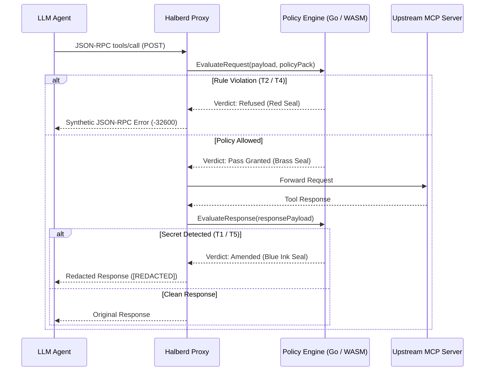

# Halberd Agent Firewall Architecture

This document describes the high-performance JSON-RPC firewall architecture, WebAssembly bridge design, and threat mitigation engine implemented in Halberd.

## Threat Matrix & Mitigation Coverage

Halberd acts as a reverse proxy sitting between an LLM agent and Model Context Protocol (MCP) tool servers. It defends against five core threats:

| Threat ID | Threat Category | Attack Vector | Halberd Mitigation |
| --- | --- | --- | --- |
| **T1** | Tool Poisoning | Compromised tool responses returning role-tag spoofing or prompt injection | Response payload scanning and sanitization |
| **T2** | Argument Injection | Hostile parameters in valid tool calls (e.g. `DROP TABLE`, `rm -rf`) | `deny_pattern` regex and AST ruleset matching |
| **T3** | Out-of-Scope I/O | Tools attempting unapproved network calls or file traversal | Network CIDR filtering and path canonicalization |
| **T4** | Capability Creep | Unvetted tools appearing mid-session via dynamic tool registration | Strict tool name whitelisting in policy packs |
| **T5** | Secret Exfiltration | Tool responses carrying secrets (AWS keys, GitHub tokens, RSA keys) | Pattern-based secret striking with `[REDACTED]` substitution |

## Request Lifecycle & Verdict Engine

Every JSON-RPC `tools/call` envelope passes through the decision engine:

## Verdict Taxonomies

1. **⚔ Refused**: Pressed in red wax when a request contains denied SQL commands, forbidden paths, or unauthorized tool names. The request never hits the upstream server.
2. **⛨ Pass Granted**: Pressed in brass when the request matches all pass rules and contains no violation patterns. Sent to upstream untouched.
3. **✎ Amended**: Pressed in blue ink when a response contains sensitive credentials (AWS keys, GitHub tokens, private RSA blocks). Secrets are struck out and replaced with `[REDACTED]`.

## WebAssembly Bridge (`cmd/halberd-wasm`)

The core Go policy engine in `internal/policy` is compiled to WebAssembly via Go's `js/wasm` architecture target. The browser playground imports `halberd.wasm` directly, executing zero-latency policy decisions inside client JavaScript without hitting a backend API server.
